<div dir="rtl">

# G9BrowserAgent

**یک مرورگر واقعی در اختیار دستیار هوش مصنوعی‌تان — مرورگر خودتان، یا مرورگری که بی‌صدا در پس‌زمینه باز می‌شود — برای تست، اشکال‌یابی و خودکارسازی برنامه‌های وب. هر کلیک دیده می‌شود، ثبت می‌شود و قابل تکرار است.**

[English](README.md) · [دانلود](https://github.com/ImanKari/G9BrowserAgent/releases/latest) ·
[مرجع فنی (انگلیسی)](docs/REFERENCE.md) · [راهنمای نصب و نگهداری (انگلیسی)](docs/INSTALL.md) · مجوز MIT

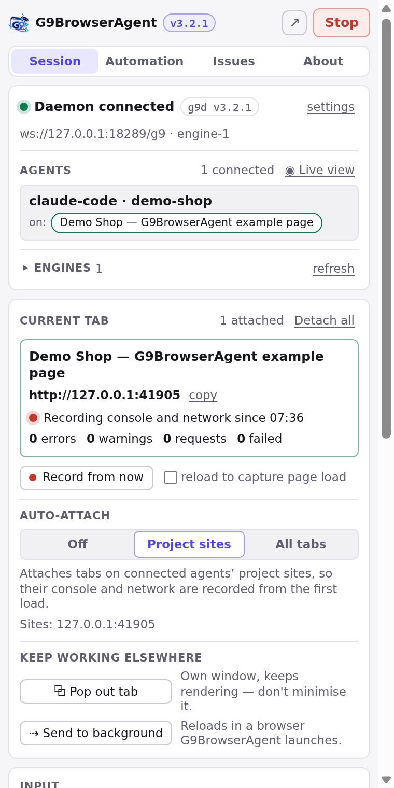

> رابط کاربری G9BrowserAgent انگلیسی است؛ برای همین نام دکمه‌ها و بخش‌ها در این راهنما همان‌طور که روی صفحه می‌بینید، به انگلیسی آمده‌اند.

---

## فهرست

- [G9BrowserAgent چیست](#g9browseragent-چیست)
- [اجزای G9BrowserAgent چطور کنار هم کار می‌کنند](#اجزای-g9browseragent-چطور-کنار-هم-کار-میکنند)
- [سیستم‌عامل‌های پشتیبانی‌شده](#سیستمعاملهای-پشتیبانیشده)
- [نصب](#نصب)
- [راه‌اندازی اولیه](#راهاندازی-اولیه)
- [افزودن افزونه به مرورگر](#افزودن-افزونه-به-مرورگر)
- [وصل کردن کلاینت هوش مصنوعی (MCP)](#وصل-کردن-کلاینت-هوش-مصنوعی-mcp)
- [اولین کار با G9BrowserAgent](#اولین-کار-با-g9browseragent)
- [پنل کناری](#پنل-کناری)
- [برنامه دسکتاپ](#برنامه-دسکتاپ)
- [ایجنت چطور مرورگر را کنترل می‌کند](#ایجنت-چطور-مرورگر-را-کنترل-میکند)
- [مرورگر روی سرور](#مرورگر-روی-سرور)
- [پروفایل‌های مرورگر](#پروفایلهای-مرورگر)
- [به‌روزرسانی](#بهروزرسانی)
- [رفع اشکال](#رفع-اشکال)
- [حذف و بازنشانی](#حذف-و-بازنشانی)
- [برای توسعه‌دهندگان](#برای-توسعهدهندگان)
- [امنیت و حریم خصوصی](#امنیت-و-حریم-خصوصی)
- [محدودیت‌های شناخته‌شده](#محدودیتهای-شناختهشده)

---

## G9BrowserAgent چیست

دستیارهای برنامه‌نویسی (Claude Code، Cursor، VS Code، Claude Desktop و بقیه) می‌توانند یک برنامه وب بنویسند، اما نمی‌توانند آن را *ببینند*. G9BrowserAgent به آن‌ها مرورگری می‌دهد که مثل یک آدم از آن استفاده کنند: صفحه را باز کنند، بخوانند، کلیک کنند، تایپ کنند، اسکرول کنند، کنسول و درخواست‌های شبکه را ببینند، عکس بگیرند و کاری را که کرده‌اند ضبط کنند تا بعداً به‌عنوان تست دوباره اجرا شود.

چه چیزی G9BrowserAgent را متفاوت می‌کند:

- **مرورگر خودتان، یا یک مرورگر پس‌زمینه.** ایجنت می‌تواند با یک افزونه‌ی کوچک در همان Edge یا Chrome که خودتان استفاده می‌کنید (با حساب‌هایی که در آن وارد شده‌اید) کار کند. یا می‌تواند مرورگر خودش را در پس‌زمینه باز کند — بدون پنجره و بدون این‌که مزاحم کار شما شود — برای کارهای طولانی یا بدون حضور شما.
- **ورودی شبیه انسان.** مسیر حرکت ماوس منحنی است، کلیک‌ها ریتم طبیعی دارند و تایپ سرعت طبیعی دارد. صفحه همان‌طور واکنش نشان می‌دهد که به یک کاربر واقعی، و با یک عدد seed می‌شود همان حرکت را دقیقاً تکرار کرد.
- **تست‌هایی که با هر انتشار نمی‌شکنند.** فرایند ضبط‌شده هر عنصر را از چند راه مختلف به خاطر می‌سپارد، پس عوض شدن یک کلاس CSS آن را از کار نمی‌اندازد. هر اجرا می‌گوید *کدام* راه هنوز جواب داده، و نسبت به آخرین اجرای تأییدشده چه چیزی تازه آمده یا گم شده.
- **مدرک کامل.** عکس صفحه، کنسول، درخواست‌های ناموفق، DOM، و بازپخش فریم‌به‌فریم با نشانگر ماوس. ثبت یک باگ همه‌ی این‌ها را با یک کلیک جمع می‌کند.
- **چند ایجنت، یک لایه‌ی مرورگر.** یک سرویس کوچک پس‌زمینه (به نام *دیمن* یا daemon) به همه‌ی ایجنت‌های روی سیستم خدمت می‌دهد. هر تب در هر لحظه فقط یک صاحب دارد، و دکمه‌ی **Stop** همه چیز را یک‌جا متوقف می‌کند.

G9BrowserAgent کاملاً روی سیستم خودتان اجرا می‌شود و چیزی به جایی نمی‌فرستد. تنها ارتباطش با بیرون، صفحه‌هایی است که تست می‌کنید (و اگر بخواهید، دانلود Chrome for Testing و بررسی به‌روزرسانی).

## اجزای G9BrowserAgent چطور کنار هم کار می‌کنند

<div dir="ltr">

```
 Your AI client (Claude Code, Cursor, …)
        │  MCP
        ▼
 G9BrowserAgent MCP shim ──────┐
 G9BrowserAgent desktop app ───┤  WebSocket, on this machine only (127.0.0.1:8765)
 G9BrowserAgent runner (CLI) ──┤
                   ▼
            G9BrowserAgent daemon (g9d) ─────────────► Engine 2: a browser G9BrowserAgent starts itself
                   │                        (Edge, Chrome or Chrome for Testing; headless by default)
                   └─────────────────────► Engine 1: the G9BrowserAgent extension in YOUR Edge or Chrome
```

</div>

| جزء | چیست | لازمش دارید؟ |
|---|---|---|
| **برنامه دسکتاپ** | برنامه‌ای که نصب می‌کنید. همه چیز را راه می‌اندازد، نشان می‌دهد ایجنت‌ها چه می‌کنند و G9BrowserAgent را به‌روز نگه می‌دارد. | توصیه می‌شود. محیط اجرای خودش را همراه دارد و به Node.js نیازی نیست. |
| **دیمن (daemon)** | یک پردازه‌ی پس‌زمینه که صاحب همه‌ی مرورگرها و تب‌هاست. هر وقت لازم باشد خودش روشن می‌شود و بعد از یک ساعت بیکاری خودش خاموش می‌شود. | همیشه — ولی هیچ‌وقت لازم نیست دستی روشنش کنید. |
| **MCP shim** | برنامه‌ی کوچکی که کلاینت هوش مصنوعی اجرا می‌کند تا ۱۵ ابزار مرورگر G9BrowserAgent را بگیرد. اگر دیمن روشن نباشد، روشنش می‌کند. | برای ایجنت‌ها بله. برنامه دسکتاپ خودش ثبتش می‌کند. |
| **افزونه (extension)** | به ایجنت اجازه می‌دهد در مرورگر خودتان (موتور ۱) و با حساب‌های واردشده‌ی شما کار کند؛ پنل کناری هم از همین‌جا می‌آید. | اختیاری. بدون آن، ایجنت از مرورگری استفاده می‌کند که G9BrowserAgent باز می‌کند (موتور ۲). |
| **Runner** | ابزار خط فرمان برای اجرای خودکار فرایندهای ضبط‌شده، مثلاً طبق زمان‌بندی یا در CI. | اختیاری. |

## سیستم‌عامل‌های پشتیبانی‌شده

| سیستم | فایل نصب | به‌روزرسانی |
|---|---|---|
| ویندوز ۱۰ و ۱۱ (x64) | `G9BrowserAgent-Setup-<version>.exe` — فقط برای کاربر خودتان نصب می‌شود و دسترسی مدیر لازم ندارد | **خودکار** |
| macOS 12 به بعد، Apple silicon | `G9BrowserAgent-<version>-mac-arm64.dmg` | G9BrowserAgent خبر می‌دهد، شما نصب می‌کنید ([چرا](#بهروزرسانی)) |
| macOS 12 به بعد، Intel | `G9BrowserAgent-<version>-mac-x64.dmg` | G9BrowserAgent خبر می‌دهد، شما نصب می‌کنید |
| لینوکس x64، هر توزیعی که دسکتاپ دارد | `G9BrowserAgent-x86_64.AppImage` | **خودکار** |
| دبیان و اوبونتو x64 | `G9BrowserAgent_<version>_amd64.deb` | G9BrowserAgent خبر می‌دهد، شما نصب می‌کنید |

مرورگرها: **Microsoft Edge** یا **Google Chrome** نسخه‌ی ۱۲۵ به بعد، یا نسخه‌ی ثابت **Chrome for Testing** که G9BrowserAgent می‌تواند برایتان دانلود کند. فایرفاکس و سافاری پشتیبانی نمی‌شوند.

G9BrowserAgent بیشتر روی ویندوز ۱۱ ساخته و اندازه‌گیری شده است. بسته‌های macOS و لینوکس در هر انتشار به‌طور خودکار ساخته، تست و از نظر به‌روزرسانی آزموده می‌شوند (بخش [محدودیت‌ها](#محدودیتهای-شناختهشده) را ببینید).

---

## نصب

فایل مناسب سیستم‌تان را از **[آخرین انتشار](https://github.com/ImanKari/G9BrowserAgent/releases/latest)** دانلود کنید.

> بسته‌ها هنوز **امضای دیجیتال ندارند**، پس ویندوز و macOS بار اول یک هشدار نشان می‌دهند. این طبیعی است و در ادامه گفته شده کجا را بزنید. در هر انتشار، هش SHA-256 همه‌ی فایل‌ها آمده تا اگر خواستید فایل دانلودی را بررسی کنید.

### ویندوز

1. فایل `G9BrowserAgent-Setup-<version>.exe` را اجرا کنید.
2. اگر پیام **"Windows protected your PC"** آمد، روی **More info** و بعد **Run anyway** بزنید.
3. G9BrowserAgent در `%LOCALAPPDATA%\Programs\G9BrowserAgent` نصب و اجرا می‌شود. به دسترسی مدیر نیازی نیست.

### macOS

1. فایل `.dmg` مناسب مک‌تان را باز کنید (`arm64` برای Apple silicon یعنی M1 به بعد، `x64` برای اینتل).
2. **G9BrowserAgent** را به پوشه‌ی **Applications** بکشید و از همان‌جا اجرایش کنید، نه از داخل دیسک ایمیج؛ وگرنه macOS آن را از یک کپی موقت اجرا می‌کند و کلاینت‌های هوش مصنوعی بعداً پیدایش نمی‌کنند.
3. بار اول macOS می‌گوید *نمی‌تواند G9BrowserAgent را از نظر بدافزار بررسی کند*. در Applications روی G9BrowserAgent راست‌کلیک (یا Control+کلیک) کنید ← **Open** ← **Open**. (یا: System Settings ← Privacy & Security ← **Open Anyway**.)
4. اگر macOS گفت G9BrowserAgent *آسیب دیده است* (damaged)، فایل دانلودی قرنطینه شده. یک بار این دستور را در Terminal اجرا کنید:

<div dir="ltr">

```bash
xattr -dr com.apple.quarantine /Applications/G9BrowserAgent.app
```

</div>

### لینوکس — AppImage (همه‌ی توزیع‌ها)

1. فایل `G9BrowserAgent-x86_64.AppImage` را جایی بگذارید که برنامه‌هایتان را نگه می‌دارید (مثلاً `~/Applications`).
   **نام فایل را عوض نکنید**: به‌روزرسانی دقیقاً همین فایل را جایگزین می‌کند و کلاینت‌های هوش مصنوعی هم به همین فایل اشاره می‌کنند.
2. قابل اجرایش کنید و اجرا کنید:

<div dir="ltr">

```bash
chmod +x G9BrowserAgent-x86_64.AppImage
./G9BrowserAgent-x86_64.AppImage
```

</div>

3. اگر پیام *"AppImages require FUSE to run"* آمد: `sudo apt install libfuse2` (در اوبونتو ۲۴.۰۴: `sudo apt install libfuse2t64`).

### لینوکس — بسته‌ی deb (دبیان، اوبونتو)

<div dir="ltr">

```bash
sudo apt install ./G9BrowserAgent_<version>_amd64.deb
```

</div>

G9BrowserAgent در منوی برنامه‌ها ظاهر می‌شود؛ مسیر نصبش `/opt/G9BrowserAgent` و فرمانش `g9browseragent` است.

---

## راه‌اندازی اولیه

G9BrowserAgent در اولین اجرا بخش **Setup** را باز می‌کند: پنج مرحله که هر کدام دکمه‌ی **Mark as done** (انجام شد) و **Skip** (رد شدن) دارد. هر وقت خواستید از نوار کناری دوباره به آن برگردید.

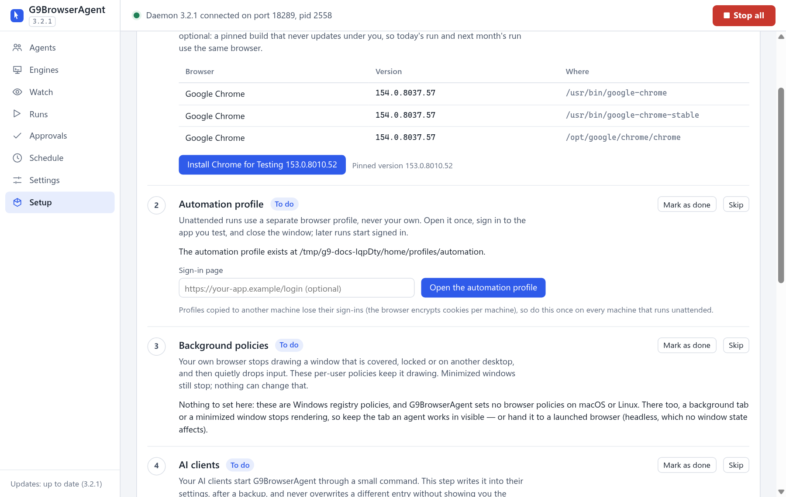

1. **Browsers (مرورگرها)** — Edge و Chrome هایی را که G9BrowserAgent پیدا کرده نشان می‌دهد. **Install Chrome for Testing** همان نسخه‌ی ثابتی را دانلود می‌کند که G9BrowserAgent با آن تست شده (حدود ۲۰۰ مگابایت، با بررسی هش SHA-256). مرورگر ثابت خودبه‌خود به‌روز نمی‌شود، پس اجرای امروز و ماه بعد روی یک مرورگر انجام می‌شود. این مرحله اختیاری است؛ G9BrowserAgent با همان Edge یا Chrome موجود هم کار می‌کند.
2. **Automation profile (پروفایل خودکارسازی)** — اجراهای پس‌زمینه پروفایل مرورگر خودشان را دارند و هرگز به پروفایل شما دست نمی‌زنند. یک بار بازش کنید، در برنامه‌ای که تست می‌کنید وارد حساب شوید و پنجره را ببندید؛ از آن به بعد اجراها با حساب واردشده شروع می‌شوند.
3. **Background policies (فقط ویندوز)** — مرورگر، پنجره‌ای را که کاملاً پوشیده شده دیگر نقاشی نمی‌کند و بی‌صدا ورودی‌ها را دور می‌ریزد. این تنظیمات اختیاری (فقط برای کاربر خودتان) مرورگر شما را فعال نگه می‌دارند تا ایجنت‌ها بتوانند وقتی شما مشغول کار دیگری هستید در آن کار کنند. G9BrowserAgent اول مقدارهای قبلی را ذخیره می‌کند و **Undo** آن‌ها را برمی‌گرداند. در macOS و لینوکس چیزی برای تنظیم نیست و خود این مرحله همین را می‌گوید.
4. **AI clients (کلاینت‌های هوش مصنوعی)** — G9BrowserAgent را در کلاینت‌هایی که پیدا می‌کند (Claude Code، Cursor، VS Code، Claude Desktop) ثبت می‌کند. اول تغییر را نشانتان می‌دهد، از فایل تنظیمات هر کلاینت نسخه‌ی پشتیبان می‌گیرد و با **Remove** هم می‌شود حذفش کرد.
5. **Browser extension (افزونه‌ی مرورگر)** — افزونه را در پوشه‌ی داده‌ی G9BrowserAgent کپی می‌کند و قدم‌به‌قدم کمک می‌کند یک بار آن را بارگذاری کنید (بخش بعد).

بعد از Setup، **کلاینت هوش مصنوعی را یک بار ببندید و دوباره باز کنید** تا ابزارهای جدید را بشناسد.

## افزودن افزونه به مرورگر

این کار اختیاری است — ایجنت همیشه می‌تواند از مرورگری که G9BrowserAgent باز می‌کند استفاده کند — اما فقط با افزونه است که ایجنت می‌تواند در **مرورگر خود شما** و با حساب‌های شما کار کند؛ پنل کناری هم با افزونه می‌آید.

1. صفحه‌ی `edge://extensions` (در Edge) یا `chrome://extensions` (در Chrome) را باز کنید.
2. **Developer mode** را روشن کنید.
3. روی **Load unpacked** بزنید و پوشه‌ای را که G9BrowserAgent آماده کرده انتخاب کنید (Setup مسیرش را در کلیپ‌بورد گذاشته است):

   | سیستم | پوشه |
   |---|---|
   | ویندوز | `%LOCALAPPDATA%\G9BrowserAgent\extension` |
   | macOS و لینوکس | `~/.g9browseragent/extension` |
   | از روی سورس | `<repository>/extension` |

4. آیکون G9BrowserAgent را به نوار ابزار سنجاق کنید و با کلیک روی آن پنل کناری را باز کنید.

پوشه را جابه‌جا نکنید؛ مرورگر افزونه را با پوشه‌اش می‌شناسد. G9BrowserAgent هنگام به‌روزرسانی همین پوشه را تازه می‌کند و افزونه خودش دوباره بارگذاری می‌شود، پس این کار فقط یک بار لازم است. (مرورگرها اجازه نمی‌دهند افزونه‌ای خارج از فروشگاهشان خودش را نصب کند؛ برای همین همین یک قدم دستی است.)

## وصل کردن کلاینت هوش مصنوعی (MCP)

**Setup ← AI clients** این کار را برایتان انجام می‌دهد. اگر خواستید دستی انجامش دهید، یک سرور MCP با نام `g9browseragent` به تنظیمات کلاینت اضافه کنید. در نسخه‌ی نصبی، این ورودی فایل اجرایی خود G9BrowserAgent را در حالت Node اجرا می‌کند:

<div dir="ltr">

```json
{
  "mcpServers": {
    "g9browseragent": {
      "command": "C:/Users/<you>/AppData/Local/Programs/G9BrowserAgent/G9BrowserAgent.exe",
      "args": ["C:/Users/<you>/AppData/Local/Programs/G9BrowserAgent/resources/mcp/shim.mjs"],
      "env": { "ELECTRON_RUN_AS_NODE": "1" }
    }
  }
}
```

</div>

| سیستم | `command` | `args` |
|---|---|---|
| ویندوز | `…/Programs/G9BrowserAgent/G9BrowserAgent.exe` | `…/Programs/G9BrowserAgent/resources/mcp/shim.mjs` |
| macOS | `/Applications/G9BrowserAgent.app/Contents/MacOS/G9BrowserAgent` | `/Applications/G9BrowserAgent.app/Contents/Resources/mcp/shim.mjs` |
| لینوکس deb | `/opt/G9BrowserAgent/g9browseragent` | `/opt/G9BrowserAgent/resources/mcp/shim.mjs` |
| لینوکس AppImage | خود فایل `.AppImage` | `~/.g9browseragent/bin/g9-run.mjs` و `mcp/shim.mjs` و `--no-sandbox` (Setup خودش می‌نویسد) |
| از روی سورس | `node` | `<repository>/mcp/shim.mjs` (بدون `env`) |

محل تنظیمات هر کلاینت: Claude Code در `~/.claude.json` (یا با دستور `claude mcp add`)، Cursor در `~/.cursor/mcp.json`، VS Code در `Code/User/mcp.json` داخل پوشه‌ی تنظیمات کاربر (آن‌جا کلید `servers` است)، و Claude Desktop در `Claude/claude_desktop_config.json` در همان پوشه. در پنل کناری هم **Connect your agent ← copy config** همین ورودی را کپی می‌کند.

بعد از آن کلاینت را دوباره باز کنید؛ کلاینت‌ها سرورهای MCP را فقط هنگام شروع بارگذاری می‌کنند.

---

## اولین کار با G9BrowserAgent

1. صفحه‌ای را که می‌خواهید تست کنید در Edge یا Chrome باز کنید و پنل کناری G9BrowserAgent را باز کنید.
2. به زبان ساده از ایجنت بخواهید. مثلاً:
   - *«این صفحه را از نظر مشکل بررسی کن.»*
   - *«با کاربر تست وارد شو و مطمئن شو فهرست سفارش‌ها بارگذاری می‌شود.»*
   - *«چرا دکمه‌ی ذخیره هیچ کاری نمی‌کند؟»*
   - *«یک فرایند خرید در فروشگاه نمونه ضبط کن و بررسی کن که شماره‌ی سفارش نمایش داده می‌شود.»*
3. ایجنت همان تبی را که جلوی چشم‌تان است برمی‌دارد و شما کارش را تماشا می‌کنید. پنل هر اقدام را همان لحظه نشان می‌دهد.

افزونه ندارید؟ از ایجنت بخواهید یک آدرس را باز کند؛ G9BrowserAgent یک مرورگر در پس‌زمینه باز می‌کند و آن‌جا کار می‌کند. بخش **Watch** در برنامه دسکتاپ نشان می‌دهد ایجنت چه می‌بیند.

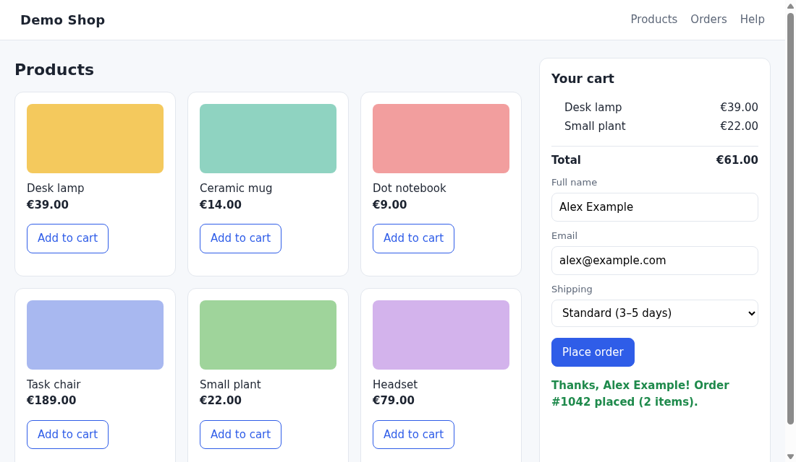

*فروشگاه نمونه‌ای که در این تصاویر می‌بینید یک صفحه‌ی ساختگی در همین مخزن است (`setup/fixtures/demo-shop.html`). دستور `node setup/serve.mjs` هم یک صفحه‌ی آزمایشی پر از باگ‌های عمدی برای پیدا کردن بالا می‌آورد.*

---

## پنل کناری

روی آیکون G9BrowserAgent در نوار ابزار بزنید. در بالای پنل همیشه این‌ها هست: نشان نسخه (با کلیک، بخش **About** باز می‌شود)، دکمه‌ی **↗** (باز کردن پنل در پنجره‌ی جدا) و **Stop** که بلافاصله همه‌ی اقدام‌های ایجنت‌ها را — هم در این مرورگر و هم در دیمن — متوقف می‌کند تا وقتی که **Resume** را بزنید.

### زبانه‌ی Session


- **وضعیت دیمن** با یک نقطه‌ی رنگی:
  - **Daemon connected** (سبز) — وصل است؛ آدرس و این‌که این مرورگر کدام موتور است (`engine-1`). برچسب `g9d vX` نسخه‌ی دیمن را نشان می‌دهد؛ اگر با نسخه‌ی افزونه فرق کند، یک هشدار می‌گوید کدام را به‌روز کنید.
  - **Connecting…** (زرد) — در حال پیدا کردن دیمن.
  - **Daemon offline** — هنوز چیزی اجرا نشده. این طبیعی است: کلاینت هوش مصنوعی وقتی وصل شود دیمن را روشن می‌کند و برنامه دسکتاپ روشن نگهش می‌دارد. افزونه خودش دوباره تلاش می‌کند (*"next try in N s"*) و **Reconnect now** همان لحظه تلاش می‌کند.
  - **Daemon refused this extension** یا **Port taken by a v1 bridge** — همراه با دلیل و راه حل؛ بعد از رفع مشکل **Try again** را بزنید.
  - لینک **settings** برای وقتی است که دیمن را روی پورتی غیر از 8765 برده‌اید.
- **Agents** — همه‌ی ایجنت‌های وصل، پروژه‌شان و تبی که رویش هستند (با کلیک، آن تب جلو می‌آید). **Engines** مرورگرهایی را که G9BrowserAgent کنترل می‌کند فهرست می‌کند.
- **Current tab (تب فعلی)** — عنوان و آدرس، این‌که کنسول و شبکه ضبط می‌شوند یا نه، و تعداد خطاها، هشدارها و درخواست‌ها. **Record from now** ضبط را روی همین تب شروع می‌کند، حتی پیش از آن‌که ایجنتی سراغش بیاید؛ با تیک **reload to capture page load** صفحه دوباره بارگذاری می‌شود تا مشکلات هنگام بارگذاری هم ثبت شوند. **Detach all** همه‌ی تب‌ها را آزاد می‌کند.
- **Auto-attach** — کدام تب‌ها از همان اولین بارگذاری ضبط شوند: **Off**، **Project sites** (پیش‌فرض: سایت‌های فایل `g9.project.json` ایجنت‌های وصل) یا **All tabs**.
- **Keep working elsewhere** — **Pop out tab** تب را به پنجره‌ی جدای خودش می‌برد (آن پنجره را پیدا نگه دارید)؛ **Send to background** کار را در مرورگری که G9BrowserAgent باز می‌کند ادامه می‌دهد (صفحه آن‌جا همراه کوکی‌هایش دوباره بارگذاری می‌شود).
- **Input** — **Direct** (فوری و دقیق)، **Human** (پیش‌فرض: حرکت منحنی ماوس، کلیک و تایپ طبیعی) یا **Stealth** (ورودی انسانی بدون هیچ میان‌بر اسکریپتی).
- **Connect your agent** ورودی MCP را برای کپی نشان می‌دهد و **Activity** همه‌ی اقدام‌های ایجنت را زنده.

<br clear="left">

### زبانه‌ی Automation

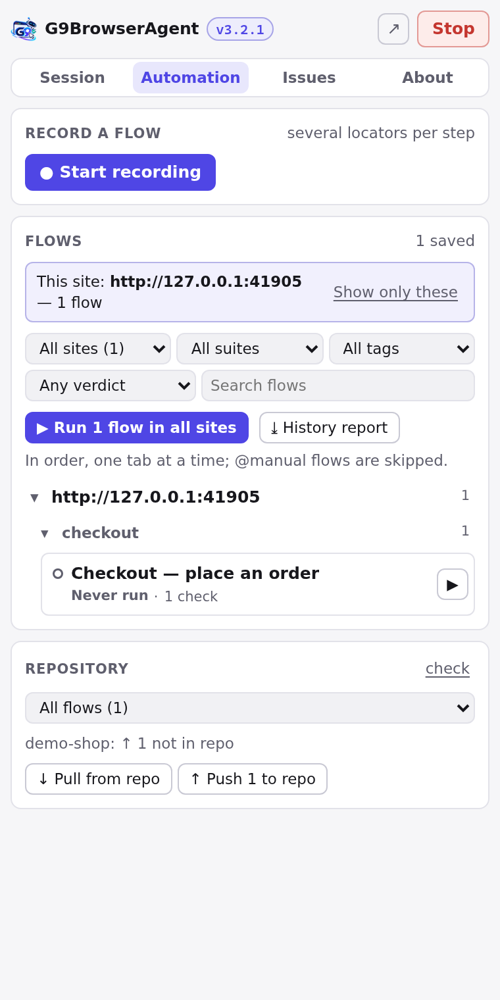

- **Start recording** — فرایند را خودتان انجام دهید؛ هر کلیک، ورود متن و انتخاب با چند راه مختلف برای پیدا کردن دوباره‌ی عنصر ذخیره می‌شود.
- **Flows** — فرایندها به تفکیک سایت و بعد مجموعه (suite)، با فیلتر سایت، مجموعه، برچسب، آخرین نتیجه، ناپایدار و جست‌وجو. **Run N flows** هر چه فیلتر نشان می‌دهد را یکی‌یکی اجرا می‌کند (فرایندهای `@manual` رد می‌شوند).
- با باز کردن هر فرایند: اجرای دوباره، اجرای آزمایشی (dry run)، افزودن بررسی، تأیید «دنیای شناخته‌شده»، تاریخچه، خروجی (تست Playwright یا FlowSpec مناسب Git) و نام، مجموعه و برچسب‌ها.
- **Repository** — **Pull from repo** و **Push all to repo** فرایندها را در پوشه‌ی پروژه‌تان نگه می‌دارند.

<br clear="left">

### زبانه‌ی Issues

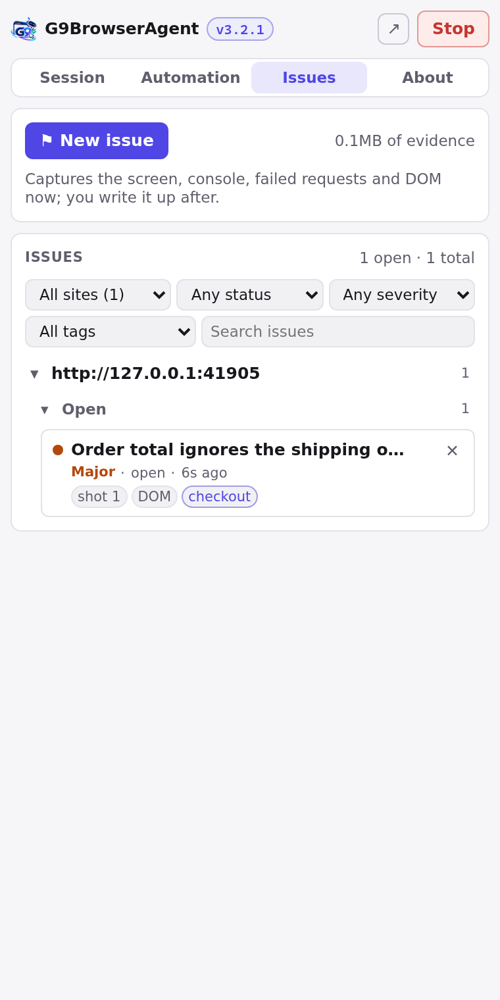

- **New issue** عکس صفحه، آدرس، کنسول، درخواست‌های ناموفق و DOM را *همان لحظه‌ای که دکمه را می‌زنید* ثبت می‌کند — وقتی باگ هنوز روی صفحه است. توضیحش را بعداً می‌نویسید.
- باگ‌ها به تفکیک سایت و بعد وضعیت (Open، Filed، Closed) دسته‌بندی می‌شوند، با شدت، زمان، کلید سیستم پیگیری و نشانه‌هایی برای مدرک‌های هر کدام. ایجنت‌ها هم می‌توانند باگ ثبت کنند (`browser_issue`).

<br clear="left">

### زبانه‌ی About

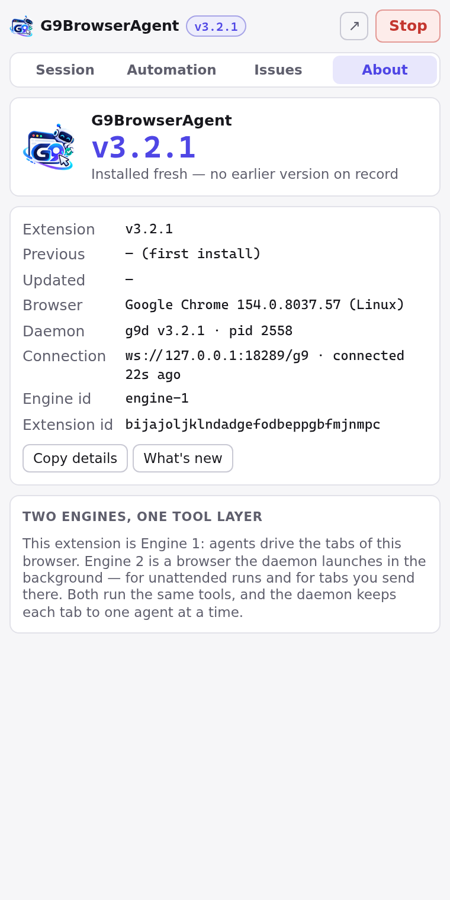

نسخه‌ی افزونه (و نسخه‌ی قبلی)، مرورگر، نسخه و پردازه‌ی دیمن، وضعیت اتصال و شناسه‌ی موتور این مرورگر. **Copy details** همه را برای گزارش باگ در کلیپ‌بورد می‌گذارد و **What's new** یادداشت تغییرات را نشان می‌دهد. بعد از هر به‌روزرسانی، یک پیام در بالای پنل یک بار خبر می‌دهد.

<br clear="left">

---

## برنامه دسکتاپ

نوار بالا همیشه وضعیت دیمن و دکمه‌ی **Stop all** را نشان می‌دهد؛ آیکون G9BrowserAgent در system tray هم **Stop all** و **Resume** دارد. پایین نوار کناری وضعیت به‌روزرسانی نوشته شده است.

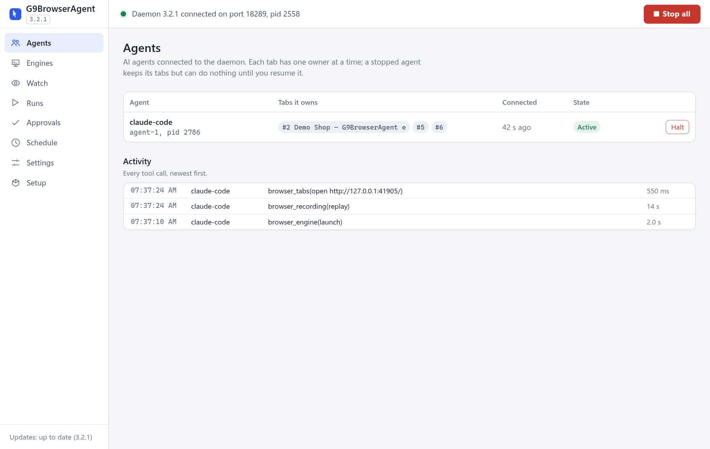

| بخش | کاربرد |
|---|---|
| **Agents** | چه کسی وصل است، هر ایجنت صاحب کدام تب‌هاست، **Halt** و **Resume** برای هر ایجنت، و گزارش زنده‌ی همه‌ی فراخوانی‌های ابزار. |
| **Engines** | مرورگر خودتان (افزونه) و مرورگرهایی که G9BrowserAgent باز کرده، با تب‌هایشان. باز کردن مرورگر جدید (نوع مرورگر، پروفایل، ورودی انسانی، stealth، زبان، منطقه‌ی زمانی، پراکسی، بدون پنجره)، **Stop** کردن، **Reload** (یا **Update and reload**) افزونه، و فهرست همه‌ی مرورگرهای نصب‌شده. |
| **Watch** | تصویر زنده و فقط‌نمایشی از هر تب، همراه نشانگر ماوس ایجنت. برای مرورگرهای بدون پنجره هم کار می‌کند. |
| **Runs** | همه‌ی اجراها: نتیجه، هر قدم و این‌که با کدام روش پیدا شد، هشدارها، «غافلگیری‌ها» نسبت به اجرای تأییدشده، و بازپخش فریم‌به‌فریم که می‌شود به ویدیو تبدیلش کرد. |
| **Approvals** | اجراهایی که چیز تازه‌ای دیده‌اند. تأییدش کنید تا وضعیت عادی جدید شود، یا بگذارید یک نفر بررسی کند. |
| **Schedule** | اجرای خودکار یک مجموعه، روزانه یا هر N دقیقه. |
| **Settings** | پیش‌فرض‌های اجراهای جدید، محدودیت‌های مدرک، دیمن، به‌روزرسانی، و «Start G9BrowserAgent when I sign in» (اجرا هنگام ورود به سیستم). |
| **Setup** | راه‌اندازی اولیه، هر وقت خواستید. |

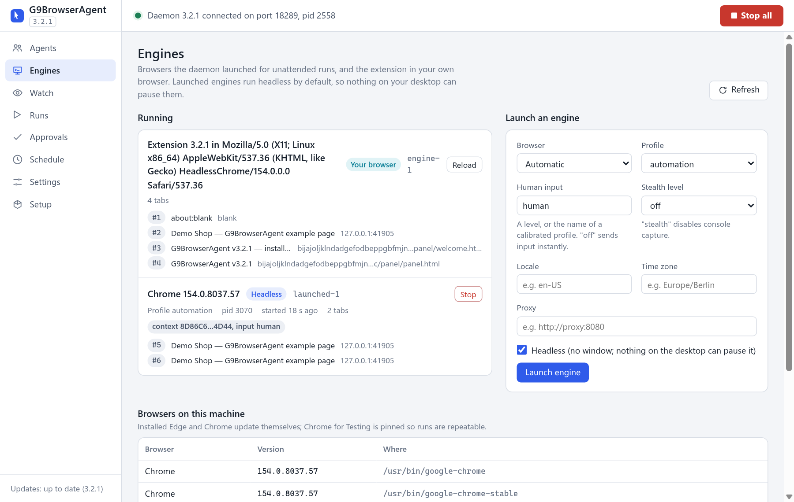

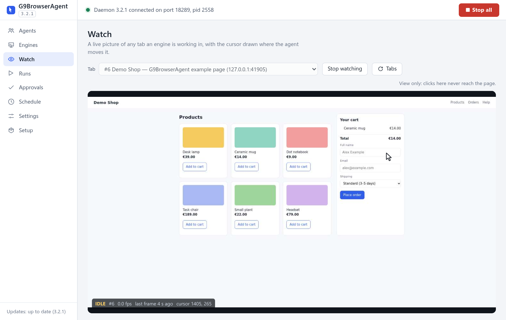

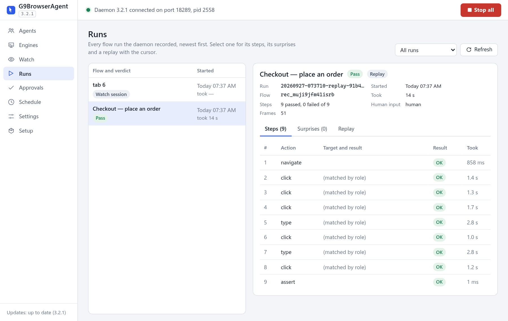

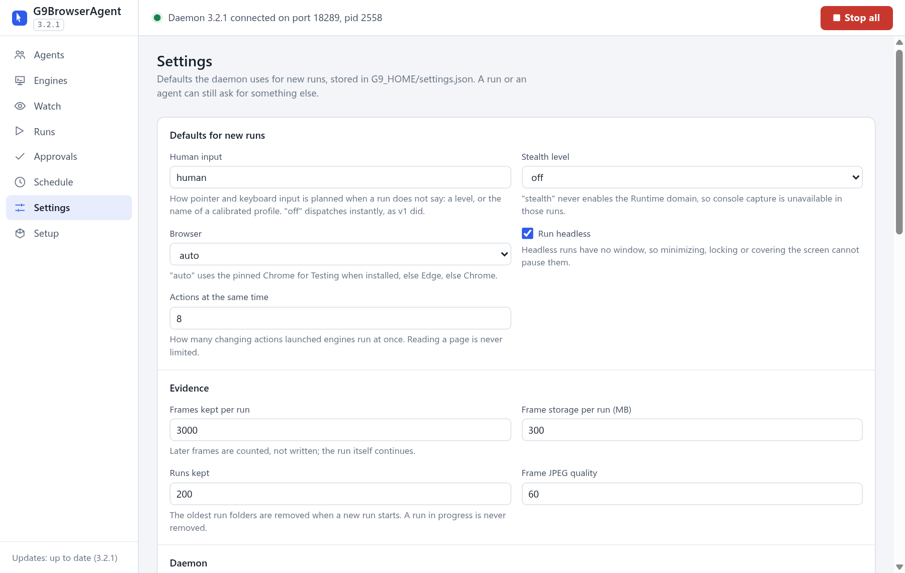

---

## ایجنت چطور مرورگر را کنترل می‌کند

ایجنت‌ها **۱۵ ابزار** دارند. پرکاربردترین‌ها:

| ابزار | کارش |
|---|---|
| `browser_status` | کجا هستم؟ تب فعلی و سلامتش، موتورها، ایجنت‌ها، و این‌که Stop زده شده یا نه. ایجنت‌ها اول این را صدا می‌زنند. |
| `browser_tabs` | فهرست، باز کردن، بستن، جلو آوردن، گرفتن تب‌ها؛ پنجره‌ی جدا؛ فرستادن به مرورگر پس‌زمینه. |
| `browser_snapshot` | خواندن صفحه به شکل درخت دسترس‌پذیری، با یک `ref` برای هر عنصر. |
| `browser_interact` | کلیک، دوبار کلیک، کلیک راست، hover، تایپ، کلید، اسکرول، کشیدن، انتخاب، آپلود — روی یک `ref`. |
| `browser_navigate` | رفتن به آدرس، بارگذاری دوباره، عقب، جلو، صبر برای بارگذاری. |
| `browser_console` و `browser_network` | خواندن پیام‌های کنسول و درخواست‌ها؛ ضبط HAR؛ ثابت کردن یا رهگیری پاسخ‌ها. |
| `browser_screenshot` و `browser_inspect` و `browser_diagnose` | عکس، DOM و استایل و ذخیره‌سازی و کوکی‌ها، و بررسی سلامت و کارایی و حافظه. |
| `browser_recording` و `browser_issue` | ضبط، اجرا و تأیید فرایندها؛ ثبت باگ همراه مدرک. |
| `browser_engine` و `browser_emulate` و `browser_dialog` | باز کردن مرورگر پس‌زمینه؛ شبیه‌سازی دستگاه، شبکه و حالت رنگ؛ پاسخ به پنجره‌های گفت‌وگو. |

فهرست کامل با همه‌ی پارامترها در [مرجع فنی](docs/REFERENCE.md#the-15-tools) است.

**ماوس و صفحه‌کلید.** ورودی از مسیر ورودی خود مرورگر (پروتکل Chrome DevTools) فرستاده می‌شود، نه با رویدادهای جاوااسکریپت؛ پس صفحه رویدادهای «واقعی» (trusted) دریافت می‌کند. در سطح پیش‌فرض **Human**، نشانگر در مسیری منحنی و با سرعت طبیعی حرکت می‌کند، کلیک فشردن و رها کردن دارد، اسکرول چرخ ماوس پله‌پله است و تایپ ریتم دارد. **Direct** ورودی دقیق و فوری می‌فرستد. **Stealth** قواعدی اضافه می‌کند برای صفحه‌هایی که دنبال نشانه‌های خودکارسازی می‌گردند. هر اجرا یک seed دارد و با همان seed همان حرکت تکرار می‌شود. جزئیات: [docs/HUMANIZE.md](docs/HUMANIZE.md).

**تب‌های پنهان.** مرورگر ورودی ماوس را به تبی که دیده نمی‌شود (تب پس‌زمینه یا پنجره‌ی کوچک‌شده) نمی‌رساند. G9BrowserAgent این را تشخیص می‌دهد و به‌جای وانمود کردن، اقدام را رد می‌کند؛ پنل کناری هم **Pop out** یا **Send to background** را پیشنهاد می‌دهد. مرورگرهای پس‌زمینه (موتور ۲) پنجره ندارند و هیچ‌وقت این مشکل را ندارند — برای هر کار بدون حضور شما از آن‌ها استفاده کنید.

**اشتراک.** هر تب یک صاحب دارد، تغییرها روی یک تب یکی‌یکی اجرا می‌شوند و بقیه‌ی ایجنت‌ها پیام روشن «صاحب این تب فلانی است» می‌گیرند. **Stop** همه چیز را متوقف می‌کند و فقط یک انسان می‌تواند ادامه دهد.

**دیدن یک تب پس‌زمینه.** ایجنت می‌تواند برای هر تبی، حتی تب‌های headless، یک **نمای زنده** باز کند (`browser_tabs action:"watch"`). پنجره‌ای در مرورگر شما حرکت صفحه را همراه با نشانگر ایجنت نشان می‌دهد. دکمه‌ی **◉ Live view** در پنل کناری هم همین نما را باز می‌کند. [جزئیات](docs/REFERENCE.md#the-live-view).

## مرورگر روی سرور

G9BrowserAgent روی سرور هم اجرا می‌شود، به‌شکل یک **browser node**، یعنی یک کانتینر Docker:
- یک دسکتاپ وب مرورگر را در یک صفحه نشان می‌دهد. آن را پشت رمز می‌بینید و برای ورود به حساب‌ها می‌توانید کنترل را دست بگیرید.
- مرورگرش افزونه را دارد و دیمن داخل خود کانتینر اجرا می‌شود.
- ایجنت‌های روی سیستم‌های دیگر با یک توکن از طریق MCP به آن وصل می‌شوند، مثلاً با `claude mcp add --transport http …`.

برای هر حساب یک کانتینر. ساخت، اجرا، nginx جلوی آن و قواعد امنیتی در [docker/README.md](docker/README.md) آمده است.

## پروفایل‌های مرورگر

- **پروفایل خودتان** فقط با افزونه و داخل مرورگر خودتان استفاده می‌شود. G9BrowserAgent هرگز از بیرون بازش نمی‌کند: Chrome و Edge از آن محافظت می‌کنند و G9BrowserAgent هم اجرای مرورگر روی آن را رد می‌کند.
- **مرورگرهای پس‌زمینه** پروفایل‌های خود G9BrowserAgent را دارند، در `G9_HOME/profiles/<name>` (پروفایل پیش‌فرض `automation` است). یک بار در آن وارد حساب شوید (مرحله‌ی ۲ Setup، یا دکمه‌ی **Warm (open headed)** در **Engines**) تا اجراهای بعدی با حساب واردشده شروع شوند. ورود به حساب فقط روی همین سیستم می‌ماند، چون مرورگرها کوکی‌ها را برای هر سیستم جداگانه رمز می‌کنند.
- G9BrowserAgent همگام‌سازی (sync) و ورود خودکار مرورگر را در پروفایل‌هایش خاموش می‌کند و اگر پروفایلی وارد حساب مرورگر شده باشد هشدار می‌دهد.

---

## به‌روزرسانی

| سیستم | چه اتفاقی می‌افتد |
|---|---|
| ویندوز و AppImage لینوکس | G9BrowserAgent هنگام شروع و بعد هر ۶ ساعت انتشارهای رسمی را بررسی می‌کند، نسخه‌ی جدید را در پس‌زمینه دانلود می‌کند، هش SHA-512 آن را بررسی می‌کند و بعد می‌پرسد: **Install now** (همین حالا)، **Install when I quit G9BrowserAgent** (هنگام بستن G9BrowserAgent)، **Not now** (بعداً) یا **Skip this version** (این نسخه را نادیده بگیر). |
| macOS و deb لینوکس | G9BrowserAgent به همان شکل بررسی می‌کند و خبر می‌دهد نسخه‌ی جدید آمده؛ **Open the release page** شما را به صفحه‌ی دانلود می‌برد. (macOS فقط برنامه‌هایی را خودکار به‌روز می‌کند که با Apple Developer ID امضا شده باشند و G9BrowserAgent هنوز امضا نشده؛ جایگزینی بسته‌ی deb هم رمز عبور مدیر می‌خواهد.) |

- هیچ کاری نیمه‌کاره نمی‌ماند: G9BrowserAgent فقط وقتی نصب می‌کند که هیچ اجرایی در جریان نباشد و هیچ مرورگر پس‌زمینه‌ای باز نباشد، و تا آن موقع هر دقیقه دوباره بررسی می‌کند.
- **افزونه همراه برنامه به‌روز می‌شود.** بعد از به‌روزرسانی، G9BrowserAgent پوشه‌ی افزونه را تازه می‌کند و افزونه — وقتی هیچ فراخوانی ایجنتی در جریان نباشد — خودش دوباره بارگذاری می‌شود. نشان نسخه در پنل کناری نسخه‌ی جدید را نشان می‌دهد. اگر این‌طور نشد، روی افزونه **Reload** بزنید (یا **Engines ← Update and reload**).
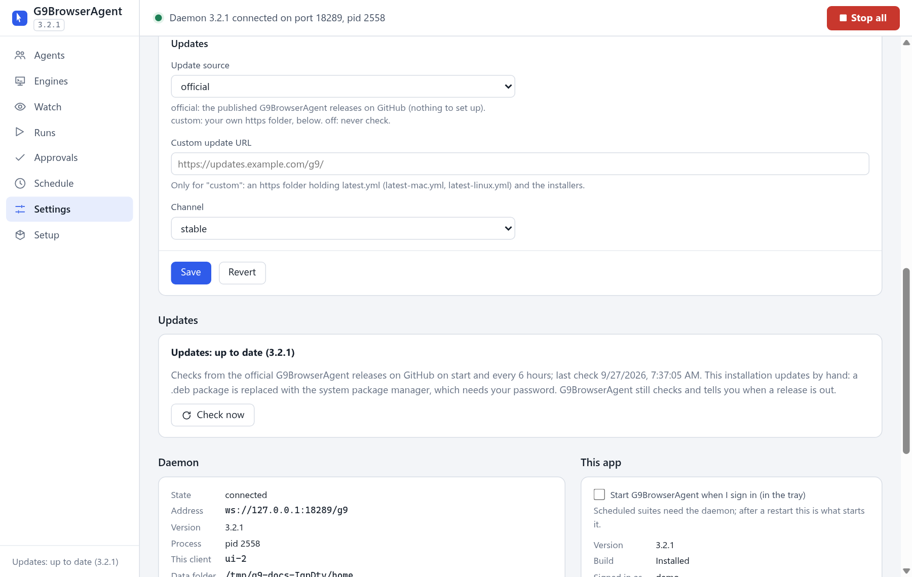

*بخش Settings ← Updates روی یک نصب لینوکسی که دستی به‌روز می‌شود. در ویندوز و AppImage، وقتی نسخه‌ی جدید آماده باشد، دکمه‌های نصب هم در همین کادر می‌آیند.*

- در **Settings ← Updates** دکمه‌ی **Check now** (همین حالا بررسی کن) و منبع به‌روزرسانی هست: **official** (پیش‌فرض، بدون هیچ تنظیمی)، **custom** (یک پوشه‌ی `https://` خودتان با همان فایل‌ها) یا **off** (خاموش).
- اگر از روی سورس استفاده می‌کنید: `git pull` و بعد Reload افزونه در مرورگر.

### ارتقا از G9 (نسخه‌ی 3.2.0 و قبل از آن)

این برنامه تا نسخه‌ی 3.2.0 **G9** نام داشت. مثل هر نسخه‌ی دیگری به G9BrowserAgent به‌روز می‌شود و بعد، کارهای مربوط به تغییر نام را خودش انجام می‌دهد:

- **کلاینت‌های هوش مصنوعی.** ورودی آن‌ها از `g9-browser` به `g9browseragent` منتقل می‌شود و برنامه‌ی با نام جدید را اجرا می‌کند (پیش از هر تغییر از فایل تنظیمات نسخه‌ی پشتیبان گرفته می‌شود). یک بار کلاینت‌ها را دوباره باز کنید.
- **پوشه‌ی داده‌ها** از `%LOCALAPPDATA%\G9` (در macOS و لینوکس `~/.g9`) به `%LOCALAPPDATA%\G9BrowserAgent` (`~/.g9browseragent`) منتقل می‌شود، همراه فرایندهای ضبط‌شده، اجراها و حساب‌های واردشده‌ی مرورگرهای پس‌زمینه — اولین باری که G9BrowserAgent اجرا می‌شود و برنامه‌ی دیگری از آن پوشه استفاده نمی‌کند، معمولاً در ورود بعدی به سیستم. برنامه بعد از آن خبر می‌دهد و **Setup ← Browser extension** را دوباره باز می‌کند: افزونه‌ی قدیمی را از صفحه‌ی افزونه‌ها حذف کنید و از پوشه‌ی جدید دوباره **Load unpacked** کنید (مرورگر افزونه را با پوشه‌اش می‌شناسد).
- **اجرا هنگام ورود به سیستم**، اگر روشن بود، همچنان کار می‌کند.
- **ویندوز:** برنامه در همان پوشه‌ای که نصب شده بود (`%LOCALAPPDATA%\Programs\G9`) می‌ماند و از این به بعد `G9BrowserAgent.exe` است؛ نصب تازه در `%LOCALAPPDATA%\Programs\G9BrowserAgent` انجام می‌شود.
- **macOS:** برنامه‌ی **G9BrowserAgent** را به Applications بکشید و برنامه‌ی قدیمی **G9** را پاک کنید.
- **دبیان و اوبونتو:** دستور `sudo apt install ./G9BrowserAgent_<version>_amd64.deb` جایگزین بسته‌ی `g9-desktop` می‌شود.

## رفع اشکال

| مشکل | چه کنید |
|---|---|
| ایجنت هیچ ابزار `browser_*` ندارد | کلاینت هوش مصنوعی را دوباره باز کنید. تنظیمات MCP آن را بررسی کنید ([وصل کردن کلاینت](#وصل-کردن-کلاینت-هوش-مصنوعی-mcp)). در macOS مطمئن شوید G9BrowserAgent از پوشه‌ی Applications اجرا می‌شود. |
| پنل می‌گوید **Daemon offline** | تا وقتی ایجنتی وصل نشده یا برنامه دسکتاپ باز نیست طبیعی است. برنامه دسکتاپ را باز کنید یا هر درخواستی به ایجنت بدهید. |
| پنل هشدار می‌دهد نسخه‌ی دیمن و افزونه فرق دارد | روی افزونه‌ی G9BrowserAgent **Reload** بزنید، یا در برنامه دسکتاپ **Engines ← Update and reload**. |
| همه چیز با پیام *"The user pressed Stop"* خطا می‌دهد | در پنل کناری یا برنامه دسکتاپ **Resume** را بزنید. ایجنت‌ها خودشان نمی‌توانند ادامه دهند. |
| پیام *"not delivered; tab hidden"* | تب در پس‌زمینه است یا پنجره کوچک شده. تب را جلو بیاورید، یا **Pop out** یا **Send to background** کنید. |
| پیام *"Tab N is owned by …"* | ایجنت دیگری از آن استفاده می‌کند. از آن ایجنت بخواهید تب را آزاد کند، یا به ایجنت خودتان بگویید می‌تواند آن را بگیرد. |
| `browser_network` هیچ درخواستی نشان نمی‌دهد | ضبط از لحظه‌ی گرفتن تب شروع می‌شود. **Record from now** را با تیک **reload to capture page load** بزنید. |
| فایروال ویندوز درباره‌ی Chrome for Testing سؤال می‌کند | هر جوابی بدهید مشکلی نیست: G9BrowserAgent از طریق pipe با مرورگر حرف می‌زند، نه از طریق شبکه. |
| macOS: پیام *"cannot be opened"* یا *"damaged"* | بخش [نصب ← macOS](#macos) را ببینید. |
| AppImage لینوکس اجرا نمی‌شود یا دیگر به‌روز نمی‌شود | `libfuse2` را نصب کنید، فایل را با `chmod +x` قابل اجرا کنید و نامش را `G9BrowserAgent-x86_64.AppImage` نگه دارید. |
| Settings ← Updates خطا نشان می‌دهد | بررسی به GitHub نرسیده (اینترنت قطع است، یا پراکسی یا فایروال جلویش را گرفته). G9BrowserAgent شش ساعت بعد دوباره تلاش می‌کند و **Check now** همان لحظه. متن وضعیت می‌گوید چه چیزی شکست خورده. |

موارد بیشتر همراه با علت‌ها: [مرجع فنی ← Troubleshooting](docs/REFERENCE.md#troubleshooting).
گزارش‌های G9BrowserAgent در `G9_HOME/logs` هستند (`daemon.log` و `desktop.log` و `install.log`).

## حذف و بازنشانی

اول، تا وقتی G9BrowserAgent هنوز نصب است، تغییرهایی را که بیرون از پوشه‌های خودش داده برگردانید:

1. **Setup ← Background policies ← Undo** (فقط ویندوز، و فقط اگر اعمالشان کرده بودید).
2. **Setup ← AI clients ← Remove** برای هر کلاینت.
3. در **Settings** گزینه‌ی **Start G9BrowserAgent when I sign in** را خاموش کنید.
4. افزونه‌ی G9BrowserAgent را از صفحه‌ی افزونه‌های مرورگر حذف کنید.
5. هر مرورگر در حال اجرا را با **Engines ← Stop** ببندید و بعد **Settings ← Shut down daemon**.

بعد خود برنامه را حذف کنید:

- **ویندوز:** Settings ← Apps ← **G9BrowserAgent** ← Uninstall.
- **macOS:** **G9BrowserAgent** را از Applications به سطل زباله بکشید.
- **لینوکس AppImage:** فایل را پاک کنید (و اگر اجرا هنگام ورود را روشن کرده بودید، `~/.config/autostart/g9browseragent.desktop` را هم).
- **لینوکس deb:** `sudo apt remove g9browseragent`.

داده‌های شما عمداً باقی می‌مانند — هر وقت مطمئن بودید دستی پاکشان کنید (فرایندهای ضبط‌شده، مدرک اجراها و حساب‌های واردشده‌ی مرورگرهای پس‌زمینه در آن‌هاست):

| سیستم | داده‌های G9BrowserAgent (`G9_HOME`) | تنظیمات برنامه |
|---|---|---|
| ویندوز | `%LOCALAPPDATA%\G9BrowserAgent` | `%APPDATA%\G9BrowserAgent` و حافظه‌ی موقت به‌روزرسانی `%LOCALAPPDATA%\g9browseragent-updater` |
| macOS | `~/.g9browseragent` | `~/Library/Application Support/G9BrowserAgent` و `~/Library/Caches/g9browseragent-updater` |
| لینوکس | `~/.g9browseragent` | `~/.config/G9BrowserAgent` و `~/.cache/g9browseragent-updater` |

**برای بازنشانی G9BrowserAgent** بدون حذف آن: دیمن را خاموش کنید (قدم ۵) و پوشه‌ی `G9_HOME` را پاک کنید یا تغییر نام دهید. اجرای بعدی مثل نصب تازه است و Setup دوباره باز می‌شود.

---

## برای توسعه‌دهندگان

هسته‌ی G9BrowserAgent فقط Node.js است و **هیچ وابستگی npm ندارد**؛ فقط برنامه دسکتاپ (Electron) وابستگی دارد.

<div dir="ltr">

```bash
git clone https://github.com/ImanKari/G9BrowserAgent.git
cd G9BrowserAgent
npm test                    # unit tests, self-test and extension suite (Node 22+)
node setup/check.mjs        # only the checks your change needs
```

</div>

- **استفاده از روی سورس:** کلاینت MCP را به `node <repo>/mcp/shim.mjs` اشاره دهید و پوشه‌ی `<repo>/extension` را با Load unpacked بارگذاری کنید. در ویندوز، `setup\install.ps1` نسخه‌ی Node را بررسی می‌کند، تست‌ها را اجرا می‌کند و تنظیمات MCP را برایتان می‌نویسد. سرویسی برای روشن کردن وجود ندارد؛ `npm run daemon` دیمن را در پیش‌زمینه و با گزارش روی صفحه اجرا می‌کند.
- **برنامه دسکتاپ از روی سورس:** `cd desktop && npm ci && npm start`.
- **ساخت بسته‌ها:** `cd desktop && npm run build:win` (یا `build:mac` و `build:linux`) — هر کدام روی سیستم خودش. خروجی همراه فایل‌های `latest*.yml` در `desktop/dist` است و `npm run verify:artifacts` همه‌ی فایل‌ها را با آن‌ها مقایسه می‌کند.
- **تست کامل به‌روزرسانی:** `node desktop/test/update-e2e.mjs --old <older build> --new desktop/dist` نسخه‌ی قدیمی را نصب می‌کند، نسخه‌ی جدید را از یک منبع محلی ارائه می‌دهد و دانلود، فایل خراب، دانلود قطع‌شده، نادیده گرفتن نسخه، دیمن مشغول، نصب هنگام بستن، راه‌اندازی دوباره و تازه شدن افزونه را امتحان می‌کند.

**تفاوت حالت توسعه و نسخه‌ی نصبی:**

| | از روی سورس | برنامه‌ی نصب‌شده |
|---|---|---|
| اسکریپت‌های G9BrowserAgent با چه اجرا می‌شوند | `node` خودتان | فایل اجرایی خود برنامه (`ELECTRON_RUN_AS_NODE=1`) — بدون نیاز به Node |
| پوشه‌ی افزونه | `<repo>/extension` | `G9_HOME/extension` که با هر به‌روزرسانی تازه می‌شود |
| به‌روزرسانی | `git pull` و Reload افزونه | خودکار (بخش [به‌روزرسانی](#بهروزرسانی)) |
| بخش به‌روزرسانی برنامه | *development build* نشان می‌دهد و هرگز بررسی نمی‌کند | انتشارهای رسمی را بررسی می‌کند |

**انتشارها** از پایپ‌لاین Azure DevOps (`azure-pipelines.yml`) می‌آیند که منبع اصلی است: همه‌ی بررسی‌های آفلاین را روی ویندوز و مجموعه‌تست‌های قابل‌حمل را روی لینوکس و macOS اجرا می‌کند، بسته‌ها را روی هر سیستم می‌سازد، تست واقعی به‌روزرسانی را روی هر کدام اجرا می‌کند، همه‌ی فایل‌ها را بررسی می‌کند و فقط بعد از آن — از شاخه‌ی `main` — نسخه را تگ می‌زند، مخزن را در GitHub آینه می‌کند و GitHub Release را منتشر می‌کند.

پیش از تغییر کد، [AIGuide.md](AIGuide.md) (تصمیم‌های طراحی و تاریخچه‌ی تغییرات) و بخش [Changing this codebase در مرجع فنی](docs/REFERENCE.md#changing-this-codebase) را بخوانید. هر تغییری در AIGuide.md ثبت می‌شود و نسخه را بالا می‌برد.

مستندات بیشتر (انگلیسی):
[مرجع فنی](docs/REFERENCE.md) ·
[راهنمای نصب و نگهداری](docs/INSTALL.md) ·
[معماری](docs/ARCHITECTURE_V2.md) ·
[پروتکل دیمن](docs/DAEMON_PROTOCOL.md) ·
[ورودی انسانی](docs/HUMANIZE.md) ·
[stealth](docs/STEALTH.md) ·
[برنامه دسکتاپ](desktop/README.md) ·
[موتور](engine/README.md)

---

## امنیت و حریم خصوصی

G9BrowserAgent به ایجنت‌ها **کنترل کامل تب‌هایی را که استفاده می‌کنند** می‌دهد — همه‌ی صفحه‌ها، کوکی‌ها و حساب‌های واردشده در آن مرورگر. با آن مثل یک کلید SSH رفتار کنید و فقط روی سیستم‌هایی استفاده‌اش کنید که به کاربران و نرم‌افزارهایش اعتماد دارید.

- **فقط محلی.** دیمن فقط روی `127.0.0.1` گوش می‌دهد، نه روی شبکه‌ی شما. صفحه‌های وب رد می‌شوند: هیچ صفحه‌ای — حتی صفحه‌ای که از خود سیستم‌تان باز شده — نمی‌تواند به آن وصل شود.
- **بدون توکن.** هر برنامه‌ای که با یک کاربر روی این سیستم اجرا می‌شود می‌تواند به دیمن وصل شود. این انتخاب عمدی برای یک سیستم تست قابل اعتماد است. تنها راه ورود از یک سیستم دیگر، نقطه‌ی MCP روی HTTP است ([مرورگر روی سرور](#مرورگر-روی-سرور)). این نقطه بدون یک توکن Bearer طولانی، بیرون از loopback گوش نمی‌دهد.
- **هیچ چیز از سیستم شما بیرون نمی‌رود.** نه تله‌متری، نه حساب کاربری. فرایندها، باگ‌ها و مدرک‌ها در `G9_HOME` و حافظه‌ی افزونه می‌مانند. تنها ارتباط‌های بیرونی: صفحه‌هایی که تست می‌کنید، بررسی به‌روزرسانی (GitHub) و اگر بخواهید، دانلود Chrome for Testing (گوگل).
- **مرورگرهای پس‌زمینه جدا هستند.** هرگز پروفایل شما را باز نمی‌کنند، همگام‌سازی‌شان خاموش است و از طریق pipe کنترل می‌شوند (هیچ پورت دیباگی باز نمی‌ماند).
- **Stop همیشه در دسترس است** و ایجنت‌ها نمی‌توانند لغوش کنند.
- وقتی افزونه تبی را کنترل می‌کند، مرورگر نوار *"started debugging this browser"* را نشان می‌دهد. این هشدار خود مرورگر است و پنهان‌شدنی نیست.
- بسته‌ها هنوز امضای دیجیتال ندارند. اگر شک دارید، هش SHA-256 را با یادداشت انتشار مقایسه کنید.

جزئیات: [مرجع فنی ← Security and trust model](docs/REFERENCE.md#security-and-trust-model).

## محدودیت‌های شناخته‌شده

- **بسته‌های بدون امضا.** SmartScreen ویندوز و Gatekeeper مک یک بار سؤال می‌کنند. **به‌روزرسانی macOS دستی است** و به‌روزرسانی بسته‌ی deb هم (G9BrowserAgent خبر می‌دهد که نسخه‌ی جدید آمده).
- **اندازه‌گیری روی ویندوز.** اندازه‌گیری‌های دقیق (وضعیت پنجره‌ها، زمان‌بندی، stealth) روی ویندوز ۱۱ انجام شده. روی macOS و لینوکس تست‌های خودکار و تست به‌روزرسانی در هر انتشار اجرا می‌شوند، اما اندازه‌گیری‌های طولانی زنده تکرار نشده‌اند.
- **امکانات مخصوص ویندوز.** تنظیماتی که مرورگر خودتان را هنگام پوشیده شدن فعال نگه می‌دارد فقط در ویندوز هست. در همه‌ی سیستم‌ها، پنجره‌ی کوچک‌شده یا تب پس‌زمینه ورودی نمی‌گیرد — برای کار بدون حضور خودتان از مرورگر پس‌زمینه (بدون پنجره) استفاده کنید.
- **فقط x64** در ویندوز و لینوکس (نسخه‌ی ARM برای آن‌ها نیست)؛ macOS هم Apple silicon دارد و هم اینتل.
- **فقط Edge و Chrome.** فایرفاکس و سافاری نه. شبیه‌سازی دستگاه، دستگاه واقعی نیست.
- **حالت بدون پنجره قابل تشخیص است** برای ابزارهای جدی ضدربات؛ stealth ردپای G9BrowserAgent را کم می‌کند، اما مرورگر بدون پنجره همچنان با مرورگر معمولی فرق دارد.
- **صفحه‌هایی که کنترل‌شدنی نیستند:** صفحه‌های `chrome://` و `edge://`، فروشگاه‌های افزونه، و پنجره‌های سیستمی (چاپ، انتخاب فایل — برای آپلود از `upload` استفاده کنید).
- **به‌روزرسانی در حالی که یک کلاینت هوش مصنوعی از G9BrowserAgent استفاده می‌کند** ممکن است ابزارهای G9BrowserAgent آن کلاینت را تا فراخوانی بعدی قطع کند.
- اصلاً اندازه‌گیری نشده: صفحه‌ی قفل‌شده، دسکتاپ مجازی دیگر، بزرگ‌نمایی نمایشگر بالای ۱۰۰٪، اجراهای طولانی‌تر از ۱۰ دقیقه.

فهرست کامل: [مرجع فنی ← Limits and known gaps](docs/REFERENCE.md#limits-and-known-gaps).

---

## مجوز

[MIT](LICENSE) © Iman Kari

</div>
